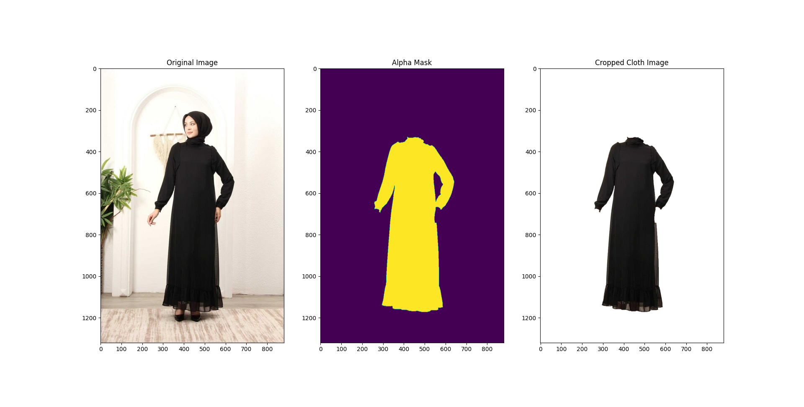

#  Kurulum ve İşleyiş

## Kurulum ve Çalıştırma

### Gerekli kütüphaneler

      python==3.8 or higher
      torch==2.1.1
      torchvision==0.16.1
      numpy==1.24.4
      opencv-python==3.8.1.78
      matplotlib==3.7.4

* Projenin çalıştırıldığı dizinde model klasörü içerisine aşağıdaki Hugging Face bağlantısındaki pre-trained model eklenmelidir. Kaggle da oluşturulmuş iMaterialist adında bir veri seti ile U2Net mimarisi kullanılarak eğitilmiştir

https://huggingface.co/oyelmali/Clothes-Semantic-Segmentation/blob/main/cloth_segm.pth

* process.py içerisinde dosya yollarını kontrol ederek veya komut satırından gerekli argümanları vererek çalıştırılmalıdır

          $ python process.py --image 'input/6.jpg' --cuda 'False' --checkpoint_path 'model/cloth_segm.pth'

*  Eğer model gpu kullanarak çalıştırmak isteniyorsa, torch-gpu versiyonu yüklenmiş ve çalışıyorsa aşağıdaki seçenekle çalıştırılabilir.

          $ python process.py --cuda 'True'

## İşleyiş

* U2Net mimarisinin işleyişi aşağıda verilmiştir

* generate_mask() fonksiyonu, U2Net mimarisi ile eğitilmiş pre-trained model kullanılarak resim girdisini çoklu resim çıktısı olarak sonuç verir
    * Maske: yarı-eğitilmiş modelin çıktısı dönüştürülmüş halidir
    * Segmentaston: Maskenin renklendirilmiş halidir, farklı sınıflar farklı renklerle ifade edilir
    * Transparan: Orjinal resim maske çıktısıyla birlikte kırpılır ve sonuç elde edilir
* get_palette() fonksiyonunun aldığı parametreyi değiştirerek bir resim üzerindeki tanınan maksimum nesne sayısı ifade edilebilir
* save_transparent_image() fonksiyonu, elde edilen maske ile orjinal resmi birleştirme fonksiyonu kullanarak yeni bir resim elde eder ve .PNG formatında kaydeder

## Sınırlamalar

* Kıyafet rengi ile arkaplan renginin birbirine yakın olduğu zamanlarda istendiği gibi sonuç vermiyor
* Geçişlere gölgenin denk gelmesi, düşük çözünürlüklü fotoğraflar, sabit çekilmeyen fotoğraflar, düşük ışıkla çekilmiş fotoğraflar doğru sonuçlar vermeyebilir
* Kıyafet üzerinde figür olan kısımlar maskelenmemiş olabilir (örneğin: ayıcık, insan figürü gibi...)

# Sonuç

* Tüylü yapıya sahip oluşundan kenarlarda renk karışmaları oluştu
  
 
 

* Kıyafetin alt tarafında gölge oluştuğu için model yanıldı
  

* Kapıda pantolonun kenarıyla paralel bir çizgi olduğu için model yanıldı
  

